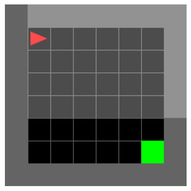

# Investigating latent space of autoencoder trained in a predictive learning task

This repository was created while trying to answer the question "How do world representations acquired through observation help us navigate the space around us?" We're investigating how a predictive learning model encodes information about space and uses this information for spatial navigation.

## The MiniGrid evnironment

In this repository, predictive learning models are trained in a MiniGrid environment (Fig. 1). A state is defined by the agent'position, its head direction (right, down, left, up) (and, possibly, positions of moving objects). The agent's possible actions are: turn the head direction left; turn the head direction right; move forward. These actions are from an egocentric point of view, however we also use allocentric actions (move right, move downwards, move left, move upwards). We implemented allocenric actions by tuning right until the head direction is aligned with the planned egocentric action, and then move forward.

  
   
  <em><b>Figure 1:</b> Example of MiniGrid world map. Walls are represented in gray; free cells in black; the agent is a red triangle, pointing to the head direction; the objective is the green cell.</em>

**Table 1:** Mapping of entity categories to their corresponding numerical identifiers used in the model environment.
| **Number** | 0 | 1 | 2 | 3 | 4 | 5 | 6 | 7 | 8 | 9 | 10 |
| :--- | :---: | :---: | :---: | :---: | :---: | :---: | :---: | :---: | :---: | :---: | :---: |
| **Entity** | Unseen | Empty | Wall | Floor | Door | Key | Ball | Box | Goal | Lava | Agent |

We use egocentric (Fig. 2) and allocentric (Fig. 3) world views to train the predictive learning models, And these are represented as matrices whose number entries correspond to the MiniGrid entities (Tab. 1).

  <table style="margin-left: auto; margin-right: auto;">
    <tr><td>2</td><td>2</td><td>2</td><td>2</td><td>2</td><td>2</td><td>2</td><td>2</td></tr>
    <tr><td>2</td><td>10</td><td>1</td><td>1</td><td>1</td><td>1</td><td>1</td><td>2</td></tr>
    <tr><td>2</td><td>1</td><td>1</td><td>1</td><td>1</td><td>1</td><td>1</td><td>2</td></tr>
    <tr><td>2</td><td>1</td><td>1</td><td>1</td><td>1</td><td>1</td><td>1</td><td>2</td></tr>
    <tr><td>2</td><td>1</td><td>1</td><td>1</td><td>1</td><td>1</td><td>1</td><td>2</td></tr>
    <tr><td>2</td><td>1</td><td>1</td><td>1</td><td>1</td><td>1</td><td>1</td><td>2</td></tr>
    <tr><td>2</td><td>1</td><td>1</td><td>1</td><td>1</td><td>1</td><td>8</td><td>2</td></tr>
    <tr><td>2</td><td>2</td><td>2</td><td>2</td><td>2</td><td>2</td><td>2</td><td>2</td></tr>
  </table>
  

    <em><b>Figure 2.</b> Allocentric view of the grid world environment, corresponding to the full world with the agent in its current position. </em>
  

  <table style="margin-left: auto; margin-right: auto;">
    <tr><td>0</td><td>0</td><td>0</td><td>0</td><td>0</td><td>0</td><td>0</td></tr>
    <tr><td>0</td><td>0</td><td>0</td><td>0</td><td>0</td><td>0</td><td>0</td></tr>
    <tr><td>2</td><td>2</td><td>2</td><td>2</td><td>2</td><td>2</td><td>2</td></tr>
    <tr><td>2</td><td>1</td><td>1</td><td>1</td><td>1</td><td>1</td><td>1</td></tr>
    <tr><td>2</td><td>1</td><td>1</td><td>1</td><td>1</td><td>1</td><td>1</td></tr>
    <tr><td>2</td><td>1</td><td>1</td><td>1</td><td>1</td><td>1</td><td>1</td></tr>
    <tr><td>2</td><td>1</td><td>1</td><td>1</td><td>1</td><td>1</td><td>1</td></tr>
  </table>
  

    <em><b>Figure 3.</b> Egocentric view of the grid world environment, a grid centered in the agent with the cells ahead of the agent. entities behind walls cannot be seen, and therefore are labelled as "unseen" (0). </em>
  

## World maps

World maps can be easily created as a text file with a grid of numbers, representing entities as described by Table 1, in the directory "maps"

## The config files

The config files make it possible to easily run the same jupyter notebook for each setting we want to test and compare.
The following parameters can be defined in the config file:

- `config_name`: string to be used as filename to saved models, results and models, and as label in some plots.
- `map_dims`: map width and height, respectively
- `start_pos`: starting agent coordinates, (x,y)
- `map_path`: path to the map file (inside the maps directory) to use 
- `observation_space`: can be `egocentric` or `allocentric`; this will define the world view provided to the world model and the available actions.
- `egocentric_view_size`: 
